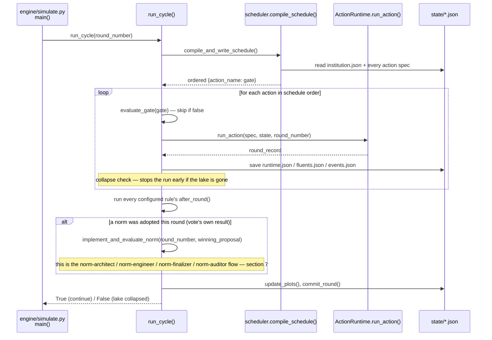
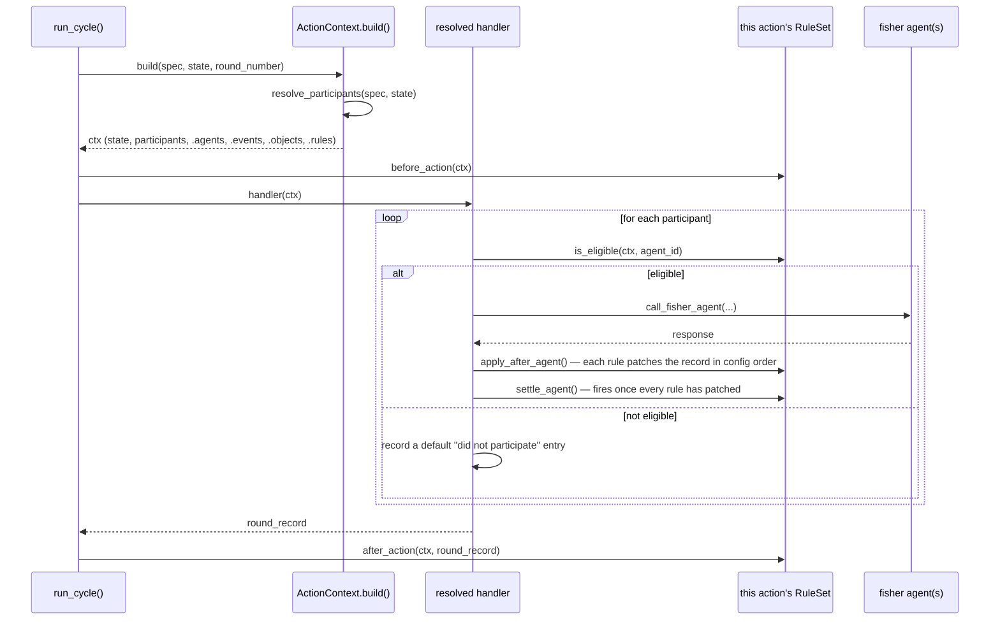
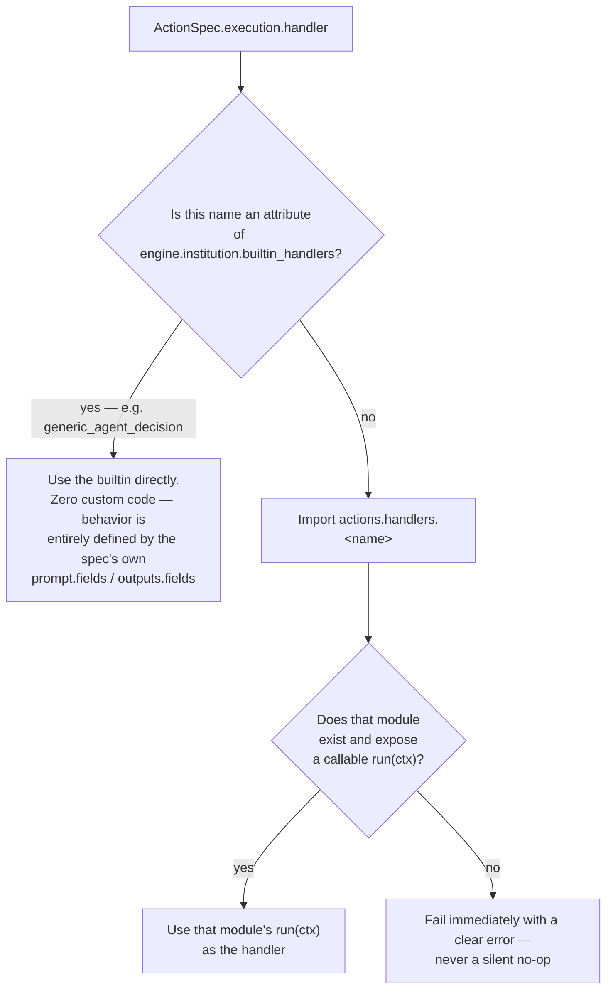
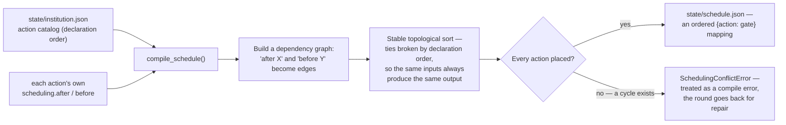

# Architecture overview

A conceptual guide to how this simulation actually runs: how a round is
executed, how an action's handler gets picked up, how execution order is
determined, how rules attach and fire, and how state files get updated.
No commands, no code — just the files and methods involved in each flow,
and diagrams showing the shape of each one. For the deep API contracts
(exact fields, exact hook signatures), see `docs/institution-contracts/`;
this document is the map, that directory is the reference.

## 1. What this is

A common-pool-resource fishery simulation: `agent_count` fisher agents
(LLM-driven) repeatedly harvest a shared lake, propose and vote on
community norms, and a three-stage pipeline institutionalizes whatever
norm wins a vote. **norm-architect** reads the norm and, before any code
exists, writes a failing pytest suite plus a complete requirement
checklist — this is a dual-model, test-driven-development split: a
reasoning-specialized model designs and pins down intent in tests first,
so the coding model that follows has a concrete, checkable target rather
than inventing its own definition of "done." **norm-engineer** then
implements against that checklist and those tests until they pass, so the
next round's harvest genuinely behaves differently, and dispatches
**norm-finalizer** (a subagent) to independently verify and record what
was actually built. Last, **norm-auditor** — a separate model instance
that never wrote the code — reviews the norm's raw text, the diff, and
both test suites together, specifically hunting for logical omissions and
under-enforcement (a requirement a test technically passes but the code
satisfies more weakly than the norm's own text demands) before the round
is trusted. Everything the fishers *do* each round (harvest, propose,
critique, vote) is itself built on the same generic "institutional
action" machinery norm-engineer uses to add new institutional
behavior — there's one mechanism, not two.

## 2. Component map

```mermaid
flowchart TB
    subgraph Orchestrator["engine/simulate.py — the orchestrator"]
        MAIN["main() / run_cycle()"]
    end

    subgraph Kernel["engine/institution/ — the generic kernel (fixed, off-limits)"]
        SCHED["scheduler.py<br/>compile_schedule()"]
        RUNTIME["runtime.py<br/>ActionRuntime, resolve_handler()"]
        CTX["context.py<br/>ActionContext"]
        RULES["rules.py<br/>Rule, RuleSet"]
        OBJ["objects.py<br/>ObjectRuntime"]
        REG["registry.py<br/>discover_subclasses / discover_handlers"]
        LIFE["lifecycle.py"]
        EVT["events.py<br/>Event, Visibility"]
    end

    subgraph Declarative["Declarative specs — what a norm round edits"]
        ISPEC["state/institution.json<br/>the catalog: which actions/roles/<br/>rule types/object types exist"]
        ASPEC["state/actions/*.json<br/>one ActionSpec per action"]
        OSPEC["state/object_types/*.json<br/>state/objects.json"]
        CONF["state/config.json<br/>active rules per action"]
    end

    subgraph Code["Optional code — only when a spec needs custom logic"]
        HANDLERS["actions/handlers/*.py<br/>run(ctx) -> round_record"]
        RULEFILES["actions/rules/{action}/*.py<br/>Rule subclasses"]
        OBJHANDLERS["objects/handlers/*.py"]
    end

    subgraph State["Live state — read/written every round"]
        RUNTIMEJSON["state/runtime.json"]
        FLUENTS["state/fluents.json"]
        EVENTS["state/events.json"]
        SCHEDJSON["state/schedule.json (compiled)"]
    end

    subgraph NormPipeline["The norm pipeline — opencode agents"]
        ARCH["norm-architect (design + failing tests)"]
        ENG["norm-engineer (implementation)"]
        FIN["norm-finalizer"]
        AUD["norm-auditor"]
    end

    MAIN --> SCHED
    SCHED --> ISPEC
    SCHED --> ASPEC
    SCHED --> SCHEDJSON
    MAIN --> RUNTIME
    RUNTIME --> CTX
    RUNTIME --> HANDLERS
    CTX --> RULES
    CTX --> OBJ
    CTX --> EVT
    RULES --> REG
    RULES --> RULEFILES
    RULES --> CONF
    OBJ --> OSPEC
    RULES --> LIFE
    RUNTIME --> RUNTIMEJSON
    CTX --> FLUENTS
    CTX --> EVENTS
    MAIN --> NormPipeline
    ARCH -.failing tests first.-> HANDLERS
    ARCH --> ENG
    ENG --> ASPEC
    ENG --> CONF
    ENG --> RULEFILES
    ENG --> HANDLERS
    ENG --> FIN
    FIN --> ISPEC
    AUD -.audits.-> HANDLERS
```



## 3. The round lifecycle

One round is: refresh the compiled schedule, run every gated-on action in
order, then (if a norm was adopted this round) run the norm pipeline,
then commit.



`main()` itself just loops: resume the in-progress round if one didn't
finish last time, otherwise start the next one, until the lake collapses
or a safety cap on round count is hit. Every run happens on its own git
branch (`ensure_run_branch()`), never on `main`.

## 4. One action's own execution — the generic shape every action shares

Every action (harvest, propose, critique, vote, and any new one) is run
through the exact same path — nothing about `ActionRuntime` or
`ActionContext` treats any one action specially:



`ActionContext.build()` resolves **who participates** from the spec's own
`participation` policy (every alive fisher, or only whoever currently
holds a named role) before the handler ever runs — a handler never
decides its own participant list.

## 5. How a handler is picked up

An action's `state/actions/{name}.json` spec names its own
`execution.handler`. `ActionRuntime.run_action()` calls
`resolve_handler()` on that name, every single time it runs the action
(never cached) — the resolution has exactly two outcomes:



This is a direct, on-demand lookup by name — not a pre-built registry.
Adding a new action is: write the spec naming a handler, and (if it's
not the builtin) drop a file at `actions/handlers/{name}.py` with a
`run(ctx)` function. Nothing else needs to be told the file exists.

**Rules attach differently — by directory scan, not by name lookup.**
Every action has its own `actions/rules/{action_name}/` directory. When
that action's `RuleSet` is built for a round, `discover_rule_types()`
scans every module in that one directory (via `engine.institution.registry.
discover_subclasses()`), imports each, and collects every `Rule` subclass
found, keyed by its own `type_name` attribute — a new rule file is
"registered" simply by existing in the right directory, no import list to
edit. `state["config"]["rules"][action_name]` (a plain list, in
enforcement order) then says which of those *discovered* types are
actually *active* this round — discovery and activation are two separate
steps, and a type can be discoverable without ever being active (exactly
the gap the project's own history calls out repeatedly: a rule file with
no matching config entry runs never, even though it compiles and would
pass every other check).

## 6. How action order is determined

`state/schedule.json` is never hand-written. Every round,
`compile_schedule()` rebuilds it from two things: `state/institution.json`'s
own action catalog (which actions exist, and in what order they were
originally declared — the tie-breaker when nothing else constrains
order), and each individual `state/actions/{name}.json`'s own
`scheduling.after`/`before` fields (each optionally naming one other
action by name).



Because this compiles fresh every round, inserting a new action between
two existing ones is purely a matter of that new action's own spec naming
the right `after`/`before` — the two existing actions are never touched,
and `state/schedule.json` itself is never a legitimate edit target for
anyone (the norm-engineer's own permissions deny writing to it
outright).

Each entry's `gate` (also compiled from the spec, e.g.
`"holdsAt(some_fluent)"`) is evaluated fresh every round too — an action
can exist in the schedule and still be skipped for a given round if its
gate doesn't hold (this is how a currently-unused action like `discuss`
stays wired in but silent).

## 7. The norm pipeline — from an adopted vote to a committed change

Runs once per round, only when that round's `vote` action actually
produced a winning proposal, and only if that round hasn't already been
committed (safe to resume after a crash).

```mermaid
sequenceDiagram
    participant Cycle as run_cycle()
    participant Arch as norm-architect (opencode)
    participant Eng as norm-engineer (opencode)
    participant Checks as engine/simulate.py<br/>compile/institution/runtime/<br/>self-correction checks
    participant Fin as norm-finalizer (subagent)
    participant Aud as norm-auditor (opencode)
    participant Git as commit_round()

    Cycle->>Arch: run_norm_architect_with_retry(round)
    Note over Arch: reads norm.txt, classifies every requirement,<br/>writes a failing pytest suite to<br/>tests/norm_checks/round_N/ — no implementation code
    Arch-->>Cycle: requirements JSON checklist (complete, verbatim)

    Cycle->>Eng: run_norm_engineer_with_retry(round, checklist + tests path)
    Note over Eng: implements against the checklist until the<br/>pre-written suite passes — edits actions/rules/,<br/>actions/handlers/, state/config.json, state/institution.json, etc.
    Eng->>Fin: dispatch via the task tool,<br/>forwarding the architect's checklist verbatim
    Fin->>Fin: independently re-verify every claimed<br/>owner file/test; register new catalog entries
    Fin-->>Eng: writes state/norm_specs/round_N.md

    Cycle->>Checks: compile / institution-drift / orphaned-rule /<br/>tests/norm_checks/round_N/ (Self-Correction Gate) / runtime checks
    alt a check fails
        Checks-->>Eng: repair message with the specific error<br/>(a failing pre-written test includes its stack trace)
        Note over Eng,Checks: loops back — bounded by MAX_NORM_REPAIR_ATTEMPTS
    else clean
        Cycle->>Aud: run_norm_auditor(round)
        Note over Aud: a separate model instance that never wrote the code —<br/>reads norm.txt + diff + BOTH test suites,<br/>hunting specifically for under-enforcement
        Aud->>Aud: writes and runs its own tests against<br/>the diff, independent of tests/norm_checks/
        Aud-->>Cycle: AUDIT_RESULT: COMPLIANT or NEEDS_REPAIR
        alt NEEDS_REPAIR
            Cycle->>Eng: repair message with the auditor's report
            Note over Eng,Aud: loops back — same repair budget
        else COMPLIANT
            Cycle->>Git: stage + commit this round's changes
        end
    end
```

If norm-architect's own opencode process fails, times out, or gets
truncated mid-task (or produces no requirements JSON, or writes no
tests), `run_norm_architect_with_retry()` retries — a separate, smaller
retry budget from the repair loop above, since a process failure says
nothing about whether the design itself is wrong. Same for
norm-engineer's own process via `run_norm_engineer_with_retry()`. If
nothing ever produces a compliant, verified result within budget, the
round's changes are discarded (`discard_norm_implementation()`) and the
simulation continues under the previous mechanics.

## 8. How state gets updated

Different kinds of state live in different files, updated by different
things, on different cadences:

| File | What it holds | Written by |
|---|---|---|
| `state/runtime.json` | Per-round records (`rounds`), current lake stock, alive/dead agents, cumulative payoff, rule/object persistent state | `ActionRuntime.run_action()` after every action; simulation-owned, never hand-edited |
| `state/fluents.json` | Interval facts with a start and possibly an end — roles, bans, `rule_active` | `roles.roles.set_fact()`/`end_fact()`, called from inside a rule/handler |
| `state/events.json` | Point-in-time occurrences — an object mutation, a one-off announcement | `ctx.events.emit(...)` / `ObjectRuntime`'s own `narration` kwarg |
| `state/config.json` | Which rule types are *currently active* per action, and their parameters | The norm-engineer, when a norm activates/changes a rule |
| `state/objects.json` | Institutional object *instances* (declarations only — never field values) | The norm-engineer, when a norm introduces a ledger/pool/permit |
| `state["runtime"]["objects"]` | The *mutable* field values for those instances | `ObjectRuntime`, at run time, seeded from the type's own declared defaults on first touch |
| `state/institution.json` | The structural catalog — which actions/roles/rule types/object types exist at all, plus a version number | The norm-engineer (content), the orchestrator (`version`/`updated_at_round`, after a compliant round) |
| `state/institution_history.jsonl` | An append-only diff log of every structural change | `record_institution_changes()`, automatically, right before a compliant round's commit |
| `state/schedule.json` | The compiled action order for this run | `compile_schedule()`, every round — never hand-edited |

The recurring split worth noticing: a **declaration** (an object instance
exists, a rule type is active, an action is registered) and its **live
value** (an object's current balance, whether a rule is currently
in-lifecycle, who currently holds a rotating role) are always kept in
different places, updated by different code, on purpose — a
norm-engineer-editable declaration file must never also be where the
simulation's own accumulated numbers live, or reverting a bad round would
either destroy real data or leave stale numbers pointing at nothing.

## 9. Roles and institutional objects, briefly

A **role** (`state/institution.json`'s `roles` catalog) is structural —
does it exist, does it rotate. **Who holds it right now** is a completely
separate, always-live lookup against `state/fluents.json`
(`roles.roles.current_holder()`), recomputed every time it's needed —
never cached anywhere, specifically so a rotation can never leave two
places disagreeing about the current holder.

An **institutional object** (a ledger, a pool, a permit) is likewise
split: its *type* (`state/object_types/*.json` — what fields it has, who
may do what to it) is separate from each *instance* (`state/objects.json`
— just an id and a type), which is separate again from that instance's
*mutable field values* (`state["runtime"]["objects"]`). All reads and
writes go through `ObjectRuntime`, never direct file edits — this is what
lets a `narration` kwarg on a deposit/withdraw automatically become both
a visible in-world notice and a memory entry, without the calling code
having to know how either of those work.

## 10. Where to look next

- `docs/institution-contracts/architecture.md` — the same routing logic
  (rule vs. action vs. object vs. role) from the norm-engineer's own
  point of view, with the Level 1-4 cost ladder.
- `docs/institution-contracts/action-contract.md` /
  `rule-contract.md` / `object-contract.md` / `role-contract.md` /
  `lifecycle-contract.md` — exact field-level contracts for each.
- `docs/institution-recipes/` — step-by-step checklists for each kind of
  change, including a worked example composing several of them for one
  norm.
- `.opencode/agent/norm-architect.md` / `norm-engineer.md` /
  `norm-finalizer.md` / `norm-auditor.md` — the actual instructions given
  to the four agents in section 7's pipeline.
