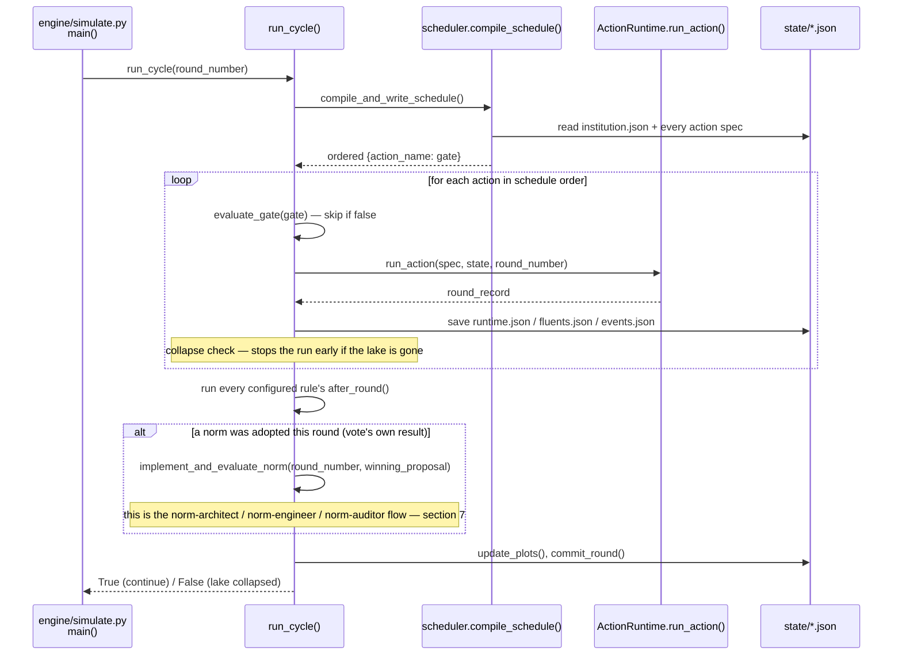
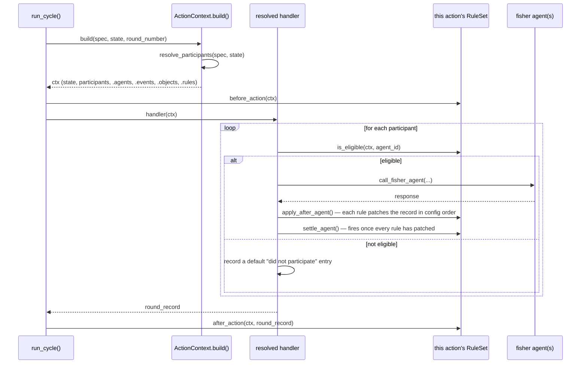
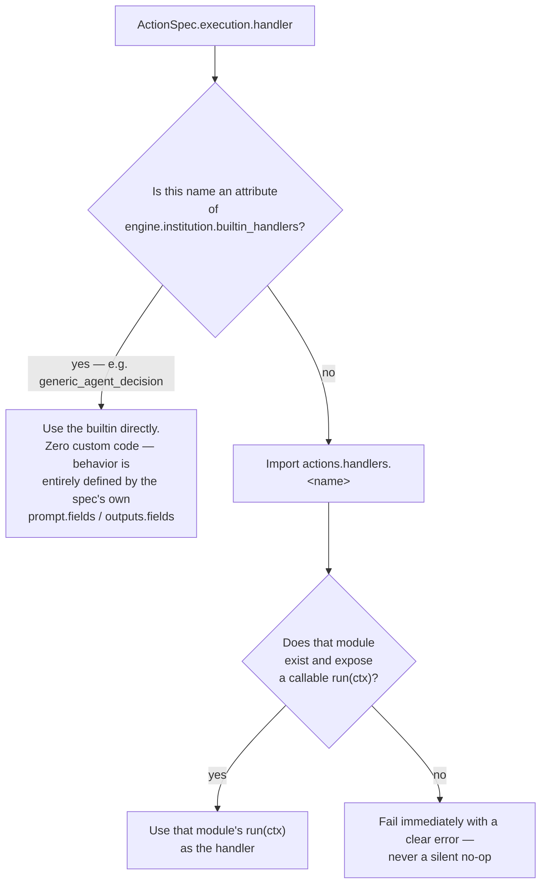
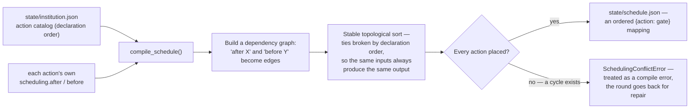
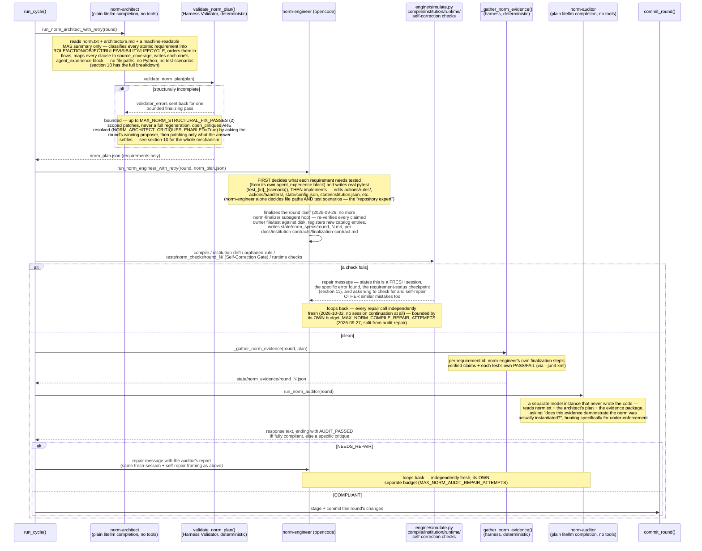
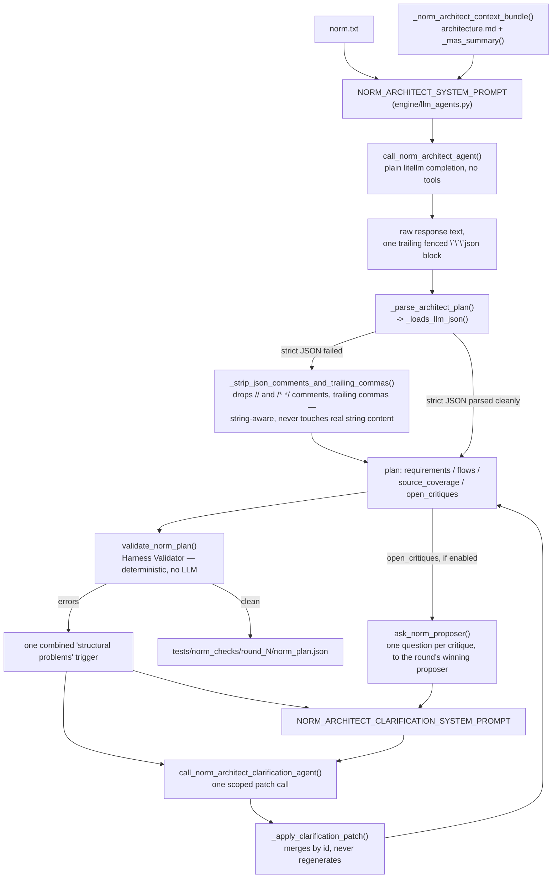
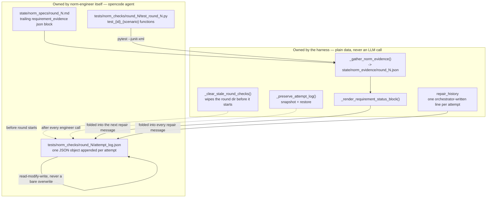

# Architecture overview

A conceptual guide to how this simulation actually runs: how a round is
executed, how an action's handler gets picked up, how execution order is
determined, how rules attach and fire, and how state files get updated.
No commands, no code — just the files and methods involved in each flow,
and diagrams showing the shape of each one. For the deep API contracts
(exact fields, exact hook signatures), see `docs/institution-contracts/`;
this document is the map, that directory is the reference.

## 1. What this is

A common-pool-resource fishery simulation: `agent_count` fisher agents
(LLM-driven) repeatedly harvest a shared lake, propose and vote on
community norms, and a semantic-compilation pipeline institutionalizes
whatever norm wins a vote. **norm-architect** reads the norm and performs
*semantic compilation only* — it classifies every atomic requirement the
norm's text implies into ROLE/ACTION/OBJECT/RULE/VISIBILITY/LIFECYCLE,
orders them into `flows`, maps every clause of the norm to the
requirement ids that implement it in `source_coverage`, and writes an
`agent_experience` block for each requirement (what a fisher now knows,
decides, may/may not do, remembers, observes) — never a file path, never
Python, never a test scenario (section 10 covers the whole breakdown).
It genuinely cannot verify any of those: it has no tools and no
repository access beyond one conceptual doc and a machine-readable
summary of the current institution. A deterministic **Harness Validator**
(`validate_norm_plan()`, no LLM call) then checks that plan is
structurally complete — every id unique, every reference resolved, every
requirement that changes a fisher's experience has an `agent_experience`
block, every clause covered — before an expensive engineer session ever
starts. (It originally
also required at least one acceptance-test entry per such requirement,
back when norm-architect itself proposed given/when/expect scenarios —
dropped after a real run showed this discarding whole rounds outright,
since DeepSeek-R1 didn't reliably converge on covering every flagged gap
even across the validator's one bounded retry pass.) **norm-engineer** is
the sole "repository expert": it decides file paths, decides what each
requirement needs tested (from its `agent_experience` block) and writes
real pytest for it, then implements against those tests until they pass,
so the next round's harvest genuinely behaves differently. It then
finalizes the round itself (2026-09-26: no more separate norm-finalizer
subagent hop — the same agent, following
`docs/institution-contracts/finalization-contract.md`, re-verifies its
own claims against disk, registers new catalog entries, and writes the
frozen spec). The harness then assembles a structured **evidence
package** (`_gather_norm_evidence()`) — per requirement, that verified
claim plus each test's own PASS/FAIL. Last, **norm-auditor** —
a separate model instance that never wrote the code — reviews the norm's
raw text against the architect's plan and that evidence package, asking
one question: *does this evidence demonstrate the norm was actually
instantiated?*, specifically hunting for under-enforcement (a requirement
whose test technically passes but which itself checks something weaker
than the norm's own text demands) before the round is trusted — this is
now the *only* backstop against a self-authored test that's too weak,
since norm-engineer both picks the scenarios and writes the assertions.
Fishery agents experience only the in-world institution this pipeline
produces — never its implementation machinery. Everything the fishers
*do* each round (harvest, propose, critique, vote) is itself built on the
same generic "institutional action" machinery norm-engineer uses to add
new institutional behavior — there's one mechanism, not two.

## 2. Component map

```mermaid
flowchart TB
    subgraph Orchestrator["engine/simulate.py — the orchestrator"]
        MAIN["main() / run_cycle()"]
    end

    subgraph Kernel["engine/institution/ — the generic kernel (fixed, off-limits)"]
        SCHED["scheduler.py<br/>compile_schedule()"]
        RUNTIME["runtime.py<br/>ActionRuntime, resolve_handler()"]
        CTX["context.py<br/>ActionContext"]
        RULES["rules.py<br/>Rule, RuleSet"]
        OBJ["objects.py<br/>ObjectRuntime"]
        REG["registry.py<br/>discover_subclasses / discover_handlers"]
        LIFE["lifecycle.py"]
        EVT["events.py<br/>Event, Visibility"]
    end

    subgraph Declarative["Declarative specs — what a norm round edits"]
        ISPEC["state/institution.json<br/>the catalog: which actions/roles/<br/>rule types/object types exist"]
        ASPEC["state/actions/*.json<br/>one ActionSpec per action"]
        OSPEC["state/object_types/*.json<br/>state/objects.json"]
        CONF["state/config.json<br/>active rules per action"]
    end

    subgraph Code["Optional code — only when a spec needs custom logic"]
        HANDLERS["actions/handlers/*.py<br/>run(ctx) -> round_record"]
        RULEFILES["actions/rules/{action}/*.py<br/>Rule subclasses"]
        OBJHANDLERS["objects/handlers/*.py"]
    end

    subgraph State["Live state — read/written every round"]
        RUNTIMEJSON["state/runtime.json"]
        FLUENTS["state/fluents.json"]
        EVENTS["state/events.json"]
        SCHEDJSON["state/schedule.json (compiled)"]
    end

    subgraph NormPipeline["The norm pipeline"]
        ARCH["norm-architect (semantic compilation)<br/>plain litellm completion, no tools"]
        VALID["validate_norm_plan()<br/>Harness Validator, deterministic, no LLM"]
        ENG["norm-engineer (test-writing + implementation<br/>+ finalization)<br/>opencode agent"]
        EVID["_gather_norm_evidence()<br/>harness, deterministic, no LLM"]
        AUD["norm-auditor (audit)<br/>plain litellm completion, no tools"]
    end

    MAIN --> SCHED
    SCHED --> ISPEC
    SCHED --> ASPEC
    SCHED --> SCHEDJSON
    MAIN --> RUNTIME
    RUNTIME --> CTX
    RUNTIME --> HANDLERS
    CTX --> RULES
    CTX --> OBJ
    CTX --> EVT
    RULES --> REG
    RULES --> RULEFILES
    RULES --> CONF
    OBJ --> OSPEC
    RULES --> LIFE
    RUNTIME --> RUNTIMEJSON
    CTX --> FLUENTS
    CTX --> EVENTS
    MAIN --> NormPipeline
    ARCH -.norm_plan.json — semantic only, no file paths.-> VALID
    VALID -.structurally valid plan.-> ENG
    ENG --> ASPEC
    ENG --> CONF
    ENG --> RULEFILES
    ENG --> HANDLERS
    ENG --> ISPEC
    ENG -.requirement_evidence.-> EVID
    EVID -.evidence package.-> AUD
    AUD -.audits plan + evidence, never raw code.-> ISPEC
```

## 3. The round lifecycle

One round is: refresh the compiled schedule, run every gated-on action in
order, then (if a norm was adopted this round) run the norm pipeline,
then commit.

```mermaid
sequenceDiagram
    participant Main as engine/simulate.py<br/>main()
    participant Cycle as run_cycle()
    participant Sched as scheduler.compile_schedule()
    participant Runtime as ActionRuntime.run_action()
    participant State as state/*.json

    Main->>Cycle: run_cycle(round_number)
    Cycle->>Sched: compile_and_write_schedule()
    Sched->>State: read institution.json + every action spec
    Sched-->>Cycle: ordered {action_name: gate}

    loop for each action in schedule order
        Cycle->>Cycle: evaluate_gate(gate) — skip if false
        Cycle->>Runtime: run_action(spec, state, round_number)
        Runtime-->>Cycle: round_record
        Cycle->>State: save runtime.json / fluents.json / events.json
        Note over Cycle: collapse check — stops the run early if the lake is gone
    end

    Cycle->>Cycle: run every configured rule's after_round()
    alt a norm was adopted this round (vote's own result)
        Cycle->>Cycle: implement_and_evaluate_norm(round_number, winning_proposal)
        Note over Cycle: this is the norm-architect / norm-engineer / norm-auditor flow — section 7
    end
    Cycle->>State: update_plots(), commit_round()
    Cycle-->>Main: True (continue) / False (lake collapsed)
```

`main()` itself just loops: resume the in-progress round if one didn't
finish last time, otherwise start the next one, until the lake collapses
or a safety cap on round count is hit. Every run happens on its own git
branch (`ensure_run_branch()`), never on `main`.

## 4. One action's own execution — the generic shape every action shares

Every action (harvest, propose, critique, vote, and any new one) is run
through the exact same path — nothing about `ActionRuntime` or
`ActionContext` treats any one action specially:

```mermaid
sequenceDiagram
    participant Cycle as run_cycle()
    participant CtxBuild as ActionContext.build()
    participant Handler as resolved handler
    participant Rules as this action's RuleSet
    participant Agents as fisher agent(s)

    Cycle->>CtxBuild: build(spec, state, round_number)
    CtxBuild->>CtxBuild: resolve_participants(spec, state)
    CtxBuild-->>Cycle: ctx (state, participants, .agents, .events, .objects, .rules)

    Cycle->>Rules: before_action(ctx)
    Cycle->>Handler: handler(ctx)
    loop for each participant
        Handler->>Rules: is_eligible(ctx, agent_id)
        alt eligible
            Handler->>Agents: call_fisher_agent(...)
            Agents-->>Handler: response
            Handler->>Rules: apply_after_agent() — each rule patches the record in config order
            Handler->>Rules: settle_agent() — fires once every rule has patched
        else not eligible
            Handler->>Handler: record a default "did not participate" entry
        end
    end
    Handler-->>Cycle: round_record
    Cycle->>Rules: after_action(ctx, round_record)
```

`ActionContext.build()` resolves **who participates** from the spec's own
`participation` policy (every alive fisher, or only whoever currently
holds a named role) before the handler ever runs — a handler never
decides its own participant list.

## 5. How a handler is picked up

An action's `state/actions/{name}.json` spec names its own
`execution.handler`. `ActionRuntime.run_action()` calls
`resolve_handler()` on that name, every single time it runs the action
(never cached) — the resolution has exactly two outcomes:

```mermaid
flowchart TD
    A["ActionSpec.execution.handler"] --> B{"Is this name an attribute<br/>of engine.institution.builtin_handlers?"}
    B -->|"yes — e.g. generic_agent_decision"| C["Use the builtin directly.<br/>Zero custom code — behavior is<br/>entirely defined by the spec's own<br/>prompt.fields / outputs.fields"]
    B -->|"no"| D["Import actions.handlers.&lt;name&gt;"]
    D --> E{"Does that module<br/>exist and expose<br/>a callable run(ctx)?"}
    E -->|"yes"| F["Use that module's run(ctx)<br/>as the handler"]
    E -->|"no"| G["Fail immediately with a clear error —<br/>never a silent no-op"]
```

This is a direct, on-demand lookup by name — not a pre-built registry.
Adding a new action is: write the spec naming a handler, and (if it's
not the builtin) drop a file at `actions/handlers/{name}.py` with a
`run(ctx)` function. Nothing else needs to be told the file exists.

**Rules attach differently — by directory scan, not by name lookup.**
Every action has its own `actions/rules/{action_name}/` directory. When
that action's `RuleSet` is built for a round, `discover_rule_types()`
scans every module in that one directory (via `engine.institution.registry.
discover_subclasses()`), imports each, and collects every `Rule` subclass
found, keyed by its own `type_name` attribute — a new rule file is
"registered" simply by existing in the right directory, no import list to
edit. `state["config"]["rules"][action_name]` (a plain list, in
enforcement order) then says which of those *discovered* types are
actually *active* this round — discovery and activation are two separate
steps, and a type can be discoverable without ever being active (exactly
the gap the project's own history calls out repeatedly: a rule file with
no matching config entry runs never, even though it compiles and would
pass every other check).

## 6. How action order is determined

`state/schedule.json` is never hand-written. Every round,
`compile_schedule()` rebuilds it from two things: `state/institution.json`'s
own action catalog (which actions exist, and in what order they were
originally declared — the tie-breaker when nothing else constrains
order), and each individual `state/actions/{name}.json`'s own
`scheduling.after`/`before` fields (each optionally naming one other
action by name).

```mermaid
flowchart LR
    A["state/institution.json<br/>action catalog (declaration order)"] --> C["compile_schedule()"]
    B["each action's own<br/>scheduling.after / before"] --> C
    C --> D["Build a dependency graph:<br/>'after X' and 'before Y' become edges"]
    D --> E["Stable topological sort —<br/>ties broken by declaration order,<br/>so the same inputs always<br/>produce the same output"]
    E --> F{"Every action placed?"}
    F -->|"yes"| G["state/schedule.json —<br/>an ordered {action: gate} mapping"]
    F -->|"no — a cycle exists"| H["SchedulingConflictError —<br/>treated as a compile error,<br/>the round goes back for repair"]
```

Because this compiles fresh every round, inserting a new action between
two existing ones is purely a matter of that new action's own spec naming
the right `after`/`before` — the two existing actions are never touched,
and `state/schedule.json` itself is never a legitimate edit target for
anyone (the norm-engineer's own permissions deny writing to it
outright).

Each entry's `gate` (also compiled from the spec, e.g.
`"holdsAt(some_fluent)"`) is evaluated fresh every round too — an action
can exist in the schedule and still be skipped for a given round if its
gate doesn't hold (this is how a currently-unused action like `discuss`
stays wired in but silent).

## 7. The norm pipeline — from an adopted vote to a committed change

Runs once per round, only when that round's `vote` action actually
produced a winning proposal, and only if that round hasn't already been
committed (safe to resume after a crash).

```mermaid
sequenceDiagram
    participant Cycle as run_cycle()
    participant Arch as norm-architect<br/>(plain litellm completion, no tools)
    participant Valid as validate_norm_plan()<br/>(Harness Validator, deterministic)
    participant Eng as norm-engineer (opencode)
    participant Checks as engine/simulate.py<br/>compile/institution/runtime/<br/>self-correction checks
    participant Evid as _gather_norm_evidence()<br/>(harness, deterministic)
    participant Aud as norm-auditor<br/>(plain litellm completion, no tools)
    participant Git as commit_round()

    Cycle->>Arch: run_norm_architect_with_retry(round)
    Note over Arch: reads norm.txt + architecture.md + a machine-readable<br/>MAS summary only — classifies every atomic requirement into<br/>ROLE/ACTION/OBJECT/RULE/VISIBILITY/LIFECYCLE, orders them in<br/>flows, maps every clause to source_coverage, writes each one's<br/>agent_experience block — no file paths, no Python, no test scenarios<br/>(section 10 has the full breakdown)
    Arch->>Valid: validate_norm_plan(plan)
    alt structurally incomplete
        Valid-->>Arch: validator_errors sent back for one<br/>bounded finalizing pass
        Note over Arch,Valid: bounded — up to MAX_NORM_STRUCTURAL_FIX_PASSES (2)<br/>scoped patches, never a full regeneration. open_critiques ARE<br/>resolved (NORM_ARCHITECT_CRITIQUES_ENABLED=True) by asking the<br/>round's winning proposer, then patching only what the answer<br/>settles — see section 10 for the whole mechanism
    end
    Valid-->>Cycle: norm_plan.json (requirements only)

    Cycle->>Eng: run_norm_engineer_with_retry(round, norm_plan.json)
    Note over Eng: FIRST decides what each requirement needs tested<br/>(from its own agent_experience block) and writes real pytest<br/>(test_{id}_{scenario}), THEN implements — edits actions/rules/,<br/>actions/handlers/, state/config.json, state/institution.json, etc.<br/>(norm-engineer alone decides file paths AND test scenarios — the "repository expert")
    Eng->>Eng: finalizes the round itself (2026-09-26, no more<br/>norm-finalizer subagent hop) — re-verifies every claimed<br/>owner file/test against disk, registers new catalog entries,<br/>writes state/norm_specs/round_N.md, per<br/>docs/institution-contracts/finalization-contract.md

    Cycle->>Checks: compile / institution-drift / orphaned-rule /<br/>tests/norm_checks/round_N/ (Self-Correction Gate) / runtime checks
    alt a check fails
        Checks-->>Eng: repair message — states this is a FRESH session,<br/>the specific error found, the requirement-status checkpoint<br/>(section 11), and asks Eng to check for and self-repair<br/>OTHER similar mistakes too
        Note over Eng,Checks: loops back — every repair call independently<br/>fresh (2026-10-02, no session continuation at all) — bounded by<br/>its OWN budget, MAX_NORM_COMPILE_REPAIR_ATTEMPTS<br/>(2026-09-27, split from audit-repair)
    else clean
        Cycle->>Evid: _gather_norm_evidence(round, plan)
        Note over Evid: per requirement id: norm-engineer's own finalization step's<br/>verified claims + each test's own PASS/FAIL (via --junit-xml)
        Evid-->>Cycle: state/norm_evidence/round_N.json
        Cycle->>Aud: run_norm_auditor(round)
        Note over Aud: a separate model instance that never wrote the code —<br/>reads norm.txt + the architect's plan + the evidence package,<br/>asking "does this evidence demonstrate the norm was<br/>actually instantiated?", hunting specifically for under-enforcement
        Aud-->>Cycle: response text, ending with AUDIT_PASSED<br/>iff fully compliant, else a specific critique
        alt NEEDS_REPAIR
            Cycle->>Eng: repair message with the auditor's report<br/>(same fresh-session + self-repair framing as above)
            Note over Eng,Aud: loops back — independently fresh, its OWN<br/>separate budget (MAX_NORM_AUDIT_REPAIR_ATTEMPTS)
        else COMPLIANT
            Cycle->>Git: stage + commit this round's changes
        end
    end
```

norm-architect (2026-09-22) and norm-auditor (2026-09-23) both stopped
running through opencode — a real run showed DeepSeek-R1 failing every
single invocation instantly with a 400 API error ("does not support
tools"), since Ollama's deepseek-r1 registry tags don't ship a
tool-calling chat template and opencode always sends one. Neither ever
actually needed real filesystem tools: norm-architect's whole job is
reading a fixed text bundle and producing text, and norm-auditor's
(2026-09-24) is cross-referencing three fixed texts — norm.txt, the
architect's own `norm_plan.json`, and the harness-assembled evidence
package — and judging whether the third actually demonstrates the norm's
own text is satisfied. Both are plain, tool-free `litellm.completion()`
calls (`call_norm_architect_agent()` / `call_norm_auditor_agent()` in
`engine/llm_agents.py`, the same shape as the fisher/critique calls) —
each one's own retry budget lives inside that function, the same place
those calls' retry loops live, not in a separate opencode
subprocess/session layer. If either completion call fails outright, the
round is discarded immediately; a norm-architect response with no
parseable, structurally valid plan (even after the Harness Validator's
one bounded finalizing pass), or a norm-auditor response with no
`AUDIT_PASSED` sentinel, is instead handled by the existing content-level
paths (design failure vs. NEEDS_REPAIR respectively) — no separate
opencode-process-retry loop for either any more. If norm-engineer's own
opencode process fails, times out, or gets truncated mid-task,
`run_norm_engineer_with_retry()` retries — a separate, smaller retry
budget from the repair loop above, since a process failure says nothing
about whether the code itself is wrong. If nothing ever produces a
compliant, verified result within budget, the round's changes are
discarded (`discard_norm_implementation()`) and the simulation continues
under the previous mechanics.

**Every one of norm-engineer's repair calls is now an independently fresh
opencode session (2026-10-02) — no continuation at all, not even
paired.** This is the end state of a longer history worth knowing, because
it's the reason continuity across attempts now lives entirely in plain
data (`repair_history`, `attempt_log.json`, the requirement-status
checkpoint — see section 11) rather than in model memory:

First (2026-09-24, by request), the session was continued across a
round's *entire* repair loop, unbounded. This targeted a confirmed real
failure: round 3 of `sim/run-20260924-005713` needed 11 memoryless
attempts to converge, and two of them failed on the exact same broken
import in the exact same file — the model guessed a plausible-but-wrong
module path twice independently, because the second attempt had no
memory the first one already tried and failed with a *different* wrong
guess.

Then (2026-09-25, by request), narrowed from the whole loop down to
pairs (repair attempt 1 & 2 share a session, 3 & 4 a new one, ...), after
round 1 of `sim/run-20260925-080825` showed the whole-loop version
*degrading* partway through — not an unbounded-growth crash, but
something subtler: attempts 0-3 did real, shrinking-but-genuine tool
work; attempt 4 dropped to a single real tool call; attempts 5-10 made
**zero** real tool calls and instead wrote fabricated `[Assistant tool
call]: ...` / `[Tool result]: ...` text into their own response — a
hallucinated verification, not a real one — while still self-reporting
full success. Pairing at 2 kept a session alive long enough to avoid
repeating an already-failed guess while staying well under where that
degradation started.

Finally (2026-10-02, by request), pairing itself was removed, after
round 1 of `sim/run-20261001-211932` showed the *same* session-growth
failure reached a different way: one fresh pair-starting attempt alone
produced 34 separate near-identical "I have successfully completed
Round 1..." text turns before finishing, and its paired continuation
then timed out completely after 3600s having produced nothing at all.
Two attempts was already enough for that round's own repetition to build
fatal context bloat — there was no smaller non-zero pairing width left to
narrow to. By this point `repair_history`, `attempt_log.json`, and the
requirement-status checkpoint (none of which existed when the 2026-09-25
pairing decision was made) could carry continuity across every attempt
without costing any context, so pairing's own original justification
(not repeating an already-failed guess) no longer needed session memory
at all to hold. `run_norm_engineer_with_retry()`'s own internal
process-retry pairing (unchanged, 2026-09-18) is a separate, narrower
mechanism — it continues a session only to retry the *same* message
after an infrastructure failure (timeout/crash/truncation), still capped
at 2 consecutive attempts, and was never implicated in either incident
above.

**Compile-repair and audit-repair draw from separate budgets
(2026-09-27)** — `MAX_NORM_COMPILE_REPAIR_ATTEMPTS` (10) for compile/
institution/orphaned-rule/missing-spec/failing-test findings,
`MAX_NORM_AUDIT_REPAIR_ATTEMPTS` (10, same size — raised from an initial 5
the same day, once a second real round showed 5 wasn't always enough: a
round bouncing between several distinct under-enforced requirements
genuinely needs more than a couple of cycles to clear all of them, not
just the first one found) for a norm-auditor NEEDS_REPAIR finding — no
longer one shared pool. Two real rounds (`sim/run-20260926-204555`) showed
why the shared pool was a problem in the first place: both needed several
compile-fixes (9-14 requirements each) before ever reaching a clean pass,
leaving almost no budget for the genuinely different, harder work of
satisfying the auditor's semantic precision demands. One of them converged
fast when it got the chance — 6 flagged requirements down to 1, then a
different 1, across its only 3 audit cycles — but ran out of the *shared*
budget one iteration short of finishing, because 9 of its 11 total repair
calls had already gone to compile-fixing. Splitting the budgets means a
round that struggles with compilation doesn't starve audit-refinement of
its own fair chance, and vice versa. Session pairing
(above) is unaffected — it still counts every repair call, of either kind,
against one combined running total for pairing purposes only, since
pairing exists to bound session lifetime regardless of which kind of
repair is happening.

## 8. How state gets updated

Different kinds of state live in different files, updated by different
things, on different cadences:

| File | What it holds | Written by |
|---|---|---|
| `state/runtime.json` | Per-round records (`rounds`), current lake stock, alive/dead agents, cumulative payoff, rule/object persistent state | `ActionRuntime.run_action()` after every action; simulation-owned, never hand-edited |
| `state/fluents.json` | Interval facts with a start and possibly an end — roles, bans, `rule_active` | `roles.roles.set_fact()`/`end_fact()`, called from inside a rule/handler |
| `state/events.json` | Point-in-time occurrences — an object mutation, a one-off announcement | `ctx.events.emit(...)` / `ObjectRuntime`'s own `narration` kwarg |
| `state/config.json` | Which rule types are *currently active* per action, and their parameters | The norm-engineer, when a norm activates/changes a rule |
| `state/objects.json` | Institutional object *instances* (declarations only — never field values) | The norm-engineer, when a norm introduces a ledger/pool/permit |
| `state["runtime"]["objects"]` | The *mutable* field values for those instances | `ObjectRuntime`, at run time, seeded from the type's own declared defaults on first touch |
| `state/institution.json` | The structural catalog — which actions/roles/rule types/object types exist at all, plus a version number | The norm-engineer (content), the orchestrator (`version`/`updated_at_round`, after a compliant round) |
| `state/institution_history.jsonl` | An append-only diff log of every structural change | `record_institution_changes()`, automatically, right before a compliant round's commit |
| `state/schedule.json` | The compiled action order for this run | `compile_schedule()`, every round — never hand-edited |

The recurring split worth noticing: a **declaration** (an object instance
exists, a rule type is active, an action is registered) and its **live
value** (an object's current balance, whether a rule is currently
in-lifecycle, who currently holds a rotating role) are always kept in
different places, updated by different code, on purpose — a
norm-engineer-editable declaration file must never also be where the
simulation's own accumulated numbers live, or reverting a bad round would
either destroy real data or leave stale numbers pointing at nothing.

## 9. Roles and institutional objects, briefly

A **role** (`state/institution.json`'s `roles` catalog) is structural —
does it exist, does it rotate. **Who holds it right now** is a completely
separate, always-live lookup against `state/fluents.json`
(`roles.roles.current_holder()`), recomputed every time it's needed —
never cached anywhere, specifically so a rotation can never leave two
places disagreeing about the current holder.

An **institutional object** (a ledger, a pool, a permit) is likewise
split: its *type* (`state/object_types/*.json` — what fields it has, who
may do what to it) is separate from each *instance* (`state/objects.json`
— just an id and a type), which is separate again from that instance's
*mutable field values* (`state["runtime"]["objects"]`). All reads and
writes go through `ObjectRuntime`, never direct file edits — this is what
lets a `narration` kwarg on a deposit/withdraw automatically become both
a visible in-world notice and a memory entry, without the calling code
having to know how either of those work.

## 10. How norm-architect breaks a norm down: requirements, `source_coverage`, and scoped fixes

Section 7 covers where this sits in the pipeline; this is the actual
data shape and the code that produces and checks it.

```mermaid
flowchart TB
    NORM["norm.txt"] --> PROMPT["NORM_ARCHITECT_SYSTEM_PROMPT<br/>(engine/llm_agents.py)"]
    BUNDLE["_norm_architect_context_bundle()<br/>architecture.md + _mas_summary()"] --> PROMPT
    PROMPT --> CALL["call_norm_architect_agent()<br/>plain litellm completion, no tools"]
    CALL --> RAW["raw response text,<br/>one trailing fenced \`\`\`json block"]
    RAW --> PARSE["_parse_architect_plan()<br/>-> _loads_llm_json()"]
    PARSE -->|strict JSON failed| LENIENT["_strip_json_comments_and_trailing_commas()<br/>drops // and /* */ comments, trailing commas —<br/>string-aware, never touches real string content"]
    LENIENT --> PLAN
    PARSE -->|strict JSON parsed cleanly| PLAN["plan: requirements / flows /<br/>source_coverage / open_critiques"]
    PLAN --> VALID["validate_norm_plan()<br/>Harness Validator — deterministic, no LLM"]
    VALID -->|errors| TRIGGER["one combined 'structural problems' trigger"]
    TRIGGER --> CLARIFY
    PLAN -->|open_critiques, if enabled| ASKPROP["ask_norm_proposer()<br/>one question per critique, to the round's winning proposer"]
    ASKPROP --> CLARIFYPROMPT["NORM_ARCHITECT_CLARIFICATION_SYSTEM_PROMPT"]
    TRIGGER --> CLARIFYPROMPT
    CLARIFYPROMPT --> CLARIFY["call_norm_architect_clarification_agent()<br/>one scoped patch call"]
    CLARIFY --> APPLY["_apply_clarification_patch()<br/>merges by id, never regenerates"]
    APPLY --> PLAN
    VALID -->|clean| FINAL["tests/norm_checks/round_N/norm_plan.json"]
```

**The requirement breakdown.** Every entry in `plan["requirements"]` has
`id`/`type`/`description`/`depends_on`/`clarity`/`clarity_critique`/
`clarity_resolution`, plus whichever type-specific fields its `type`
calls for — `actor`/`judgment_required`/`trigger`/`decision_context` on
an ACTION, `attached_to`/`deterministic`/`condition`/`effect` on a RULE,
`assigned_by` on an exclusive ROLE, `target`/`audience` on a VISIBILITY,
`duration_rounds` on a LIFECYCLE — and an `agent_experience` block for
every ROLE/ACTION/RULE/VISIBILITY requirement. `plan["flows"]` is the
ordered interaction sequence (which steps happen before/after which,
under what trigger); `plan["open_critiques"]` is genuinely unresolved
ambiguity the architect found and couldn't safely guess at.

**`source_coverage` is the architect's own proof that nothing from the
norm silently disappeared.** Each entry pairs one clause of norm.txt's
Operationalization — its own text, verbatim — with the requirement ids
that implement it and a `COVERED`/`PARTIAL`/`AMBIGUOUS` verdict.
`_norm_clause_count()` counts how many separately-coverable clauses the
norm actually has (its numbered items when it numbers them, its
sentences otherwise), and `_norm_plan_clause_coverage_errors()` rejects a
plan with fewer `source_coverage` entries than that count — a plan can
no longer fold four clauses into one summarizing entry and call it
`COVERED`. This exists because a real plan (`sim/run-20260930-224347`,
Lake Guard) silently dropped the seasonal/annual appointment mechanism
for two roles, a vote's own numeric threshold, a nightly review action,
and a fine's own application/deduction step — each one a real clause
with no requirement at all, invisible until a human read the plan by
hand.

**`validate_norm_plan()` (the Harness Validator) checks the rest of the
cross-references mechanically**, via `_norm_plan_reference_errors()`:
`actor` must be a ROLE requirement id, an existing role's name, or
`"all_fishers"` — never a collective like `"community"` a single agent
can't be prompted as; a RULE's `attached_to` must name a real ACTION, not
an arbitrary nearby one; an exclusive ROLE needs `assigned_by` (the
id(s) of whatever actually grants it — a role existing is not the same
as anyone holding it); `depends_on` references must exist and
`_norm_plan_dependency_cycle_errors()` rejects a cycle among them; every
`flows` step must name a real requirement; a judgment-requiring ACTION
needs a `decision_context` with at least `prompt_to` and `output`. None
of this is model self-report — every check reads the plan's own fields
directly.

**A fix is always a scoped patch, never a full regeneration.** When
`validate_norm_plan()` finds structural problems, or an `open_critique`
gets an answer (via `ask_norm_proposer()`, gated by
`NORM_ARCHITECT_CRITIQUES_ENABLED`, capped at
`MAX_NORM_CLARIFICATIONS_PER_ROUND` critiques per round), the harness
calls `call_norm_architect_clarification_agent()` with
`NORM_ARCHITECT_CLARIFICATION_SYSTEM_PROMPT` — a response that names only
`affected_requirements` (ids whose own object is being replaced),
`unchanged_requirements` (every other existing id — together with
`affected_requirements` they must account for all of them), optionally
`added_requirements` (genuinely new ids a coverage gap needs) and a
`requirements` list with exactly the affected/added objects, and
optionally a full replacement `flows`/`source_coverage` list.
`_apply_clarification_patch()` enforces this mechanically: it only ever
takes an object from the patch's own `requirements` if its id is in
`affected_requirements`/`added_requirements` — every other id is copied
*verbatim* from the plan exactly as it already stood, by Python object
identity, regardless of what else the model's response contains. A key
that's simply absent (a patch touching only `source_coverage` has
nothing to put in `requirements`) defaults to empty rather than
invalidating the whole patch; a key present with the wrong type is still
rejected. Up to `MAX_NORM_STRUCTURAL_FIX_PASSES` (2) structural-fix
passes run before the round is discarded as a design failure.

## 11. norm-engineer's attempt log and the requirement-status checkpoint

Section 7's repair loop needs a way for one attempt to know what an
earlier one already tried, now that no attempt shares a session with
any other (section 7's closing note). Three separate, complementary
mechanisms carry that continuity — none of them cost context the way a
growing session does, and none of them trust the model's own account of
itself over what the harness can actually verify.

```mermaid
flowchart TB
    subgraph Harness["Owned by the harness — plain data, never an LLM call"]
        RH["repair_history<br/>one orchestrator-written line per attempt"]
        EVID["_gather_norm_evidence()<br/>-> state/norm_evidence/round_N.json"]
        STATUS["_render_requirement_status_block()"]
        PRESERVE["_preserve_attempt_log()<br/>snapshot + restore"]
        CLEAR["_clear_stale_round_checks()<br/>wipes the round dir before it starts"]
    end
    subgraph Engineer["Owned by norm-engineer itself — opencode agent"]
        LOG["tests/norm_checks/round_N/attempt_log.json<br/>one JSON object appended per attempt"]
        TESTS["tests/norm_checks/round_N/test_round_N.py<br/>test_{id}_{scenario} functions"]
        SPEC["state/norm_specs/round_N.md<br/>trailing requirement_evidence json block"]
    end

    CLEAR -.before round starts.-> LOG
    LOG -->|"norm-engineer reads this first"| LOG
    LOG -->|"read-modify-write, never a bare overwrite"| LOG
    PRESERVE -.after every engineer call.-> LOG

    SPEC --> EVID
    TESTS -->|pytest --junit-xml| EVID
    EVID --> STATUS
    STATUS -->|folded into the next repair message| LOG
    RH -->|folded into every repair message| LOG
```

**`attempt_log.json` is norm-engineer's own account, owned entirely by
norm-engineer — the harness never parses its content**, only mentions
its path in `_render_engineer_repair_preamble()`'s standing instruction.
`.opencode/agents/norm-engineer.md` tells it this is a read-modify-write,
not a single `write` call: read the file first (an empty list if it
doesn't exist), parse it as a JSON array, append exactly one new object
for this attempt (`attempt`/`requirement_ids`/`approach`/`reasoning`/
`files_changed`/`verified`), write the whole array back. This exists
because a real round's own transcript contained the literal phrase "the
attempt_log shows my work from attempt 5 which may be lost now" — its
own `write` calls had been replacing the file's entire content with just
that attempt's one new object every time. `_preserve_attempt_log()`
closes the gap a permission denial can't: after every norm-engineer
call, the harness compares the file against its own saved copy, and if
entries were deleted, emptied, or corrupted (a real round ran `rm -f` on
it directly, mid-attempt, through its own shell access), restores the
saved entries plus whatever new ones were actually added.
`_clear_stale_round_checks()` empties the whole `tests/norm_checks/round_N/`
directory before norm-architect even runs — a leftover from an earlier
run that happened to share the same round number and working directory
was once read by norm-engineer as its *own* history, for a completely
different norm.

**The requirement-status checkpoint is the harness's own independent
measurement of progress, built from real test results, not self-report.**
`_gather_norm_evidence()` runs `tests/norm_checks/round_N/` once with
`--junit-xml`, matches each `test_{id}_{scenario}` function's PASS/FAIL
back to its requirement id, folds in norm-engineer's own
`requirement_evidence` claims from `state/norm_specs/round_N.md`'s
trailing block, and writes the result to
`state/norm_evidence/round_N.json` — a real file, so a crash mid-round
loses nothing. `_render_requirement_status_block()` then classifies
every requirement into exactly one bucket and folds that block into the
*next* repair message: **Flagged by the auditor** (named in the
auditor's own verdict this round — never reported as done, even if its
tests pass, since the tests evidently don't cover what the auditor
found); **Named in an error** (one of its own files appears in a current
compile error — not done, whatever its tests say); **Satisfied** /
**Tests pass for** (preserve this, don't rebuild it — "Tests pass for"
instead of "Satisfied" specifically when compile errors are still open
elsewhere, so the phrasing itself never contradicts the errors listed
above it); **No test evidence at all** (a missing test, or only
`EMPTY` ones — see next paragraph — which is a test-writing gap, not
proof the code is wrong).

A test only counts as evidence if it actually checks something.
`_tests_without_assertions()` parses the test file's own syntax tree and
treats a `test_*` function as empty if it contains no `assert`,
`pytest.raises`/`warns`, no `assert*`-named call, and no call to a
same-file helper that itself checks something — a `def test_R3_x():
pass` always "passes" regardless of what was built. Such a test is
recorded as `EMPTY` (not `PASS`) in the evidence, so it gives its
requirement no credit, and `norm_implementation_empty_tests_errors()`
rejects a whole suite outright as a compile-class error if *every* test
in it is like this. This exists because a real round's norm-engineer
wrote ten such stubs in its very first call and kept them for all 17
compile- and audit-repair attempts that followed — every requirement
read as done from the start, the compile gate never caught it, and the
round discarded 5.3 hours later having never written one real
assertion.

## 12. Where to look next

- `docs/institution-contracts/architecture.md` — the same routing logic
  (rule vs. action vs. object vs. role) from the norm-engineer's own
  point of view, with the Level 1-4 cost ladder.
- `docs/institution-contracts/action-contract.md` /
  `rule-contract.md` / `object-contract.md` / `role-contract.md` /
  `lifecycle-contract.md` / `finalization-contract.md` — exact field-level
  contracts for each, plus the round-finalization procedure norm-engineer
  now follows itself.
- `docs/institution-recipes/` — step-by-step checklists for each kind of
  change, including a worked example composing several of them for one
  norm.
- `engine/llm_agents.py`'s `NORM_ARCHITECT_SYSTEM_PROMPT` /
  `NORM_ARCHITECT_CLARIFICATION_SYSTEM_PROMPT` / `NORM_AUDITOR_SYSTEM_PROMPT`
  — norm-architect's, its own scoped-patch mode's, and norm-auditor's
  actual standing instructions (all three are plain completion calls, not
  opencode agents, so none has a `.opencode/agents/*.md` file of its
  own).
- `.opencode/agents/norm-engineer.md` — the actual instructions given to
  the one remaining opencode agent in section 7's pipeline (2026-09-26:
  no more separate norm-finalizer subagent), including its own
  `attempt_log.json` read-modify-write procedure (section 11) and the
  test-naming convention (`test_{id}_{scenario}`) the requirement-status
  checkpoint depends on.
- `engine/simulate.py`'s `validate_norm_plan()`, `_apply_clarification_patch()`,
  `_gather_norm_evidence()`, `_render_requirement_status_block()`, and
  `_preserve_attempt_log()` — sections 10 and 11's own code, each with a
  docstring citing the real round that motivated it.
